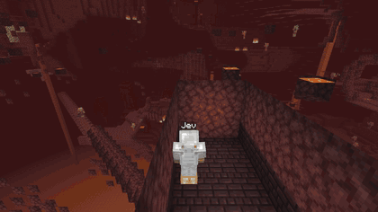
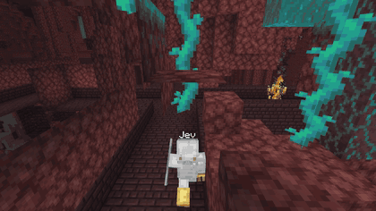
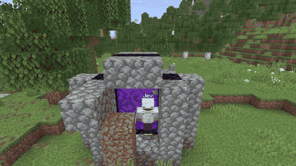
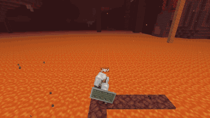
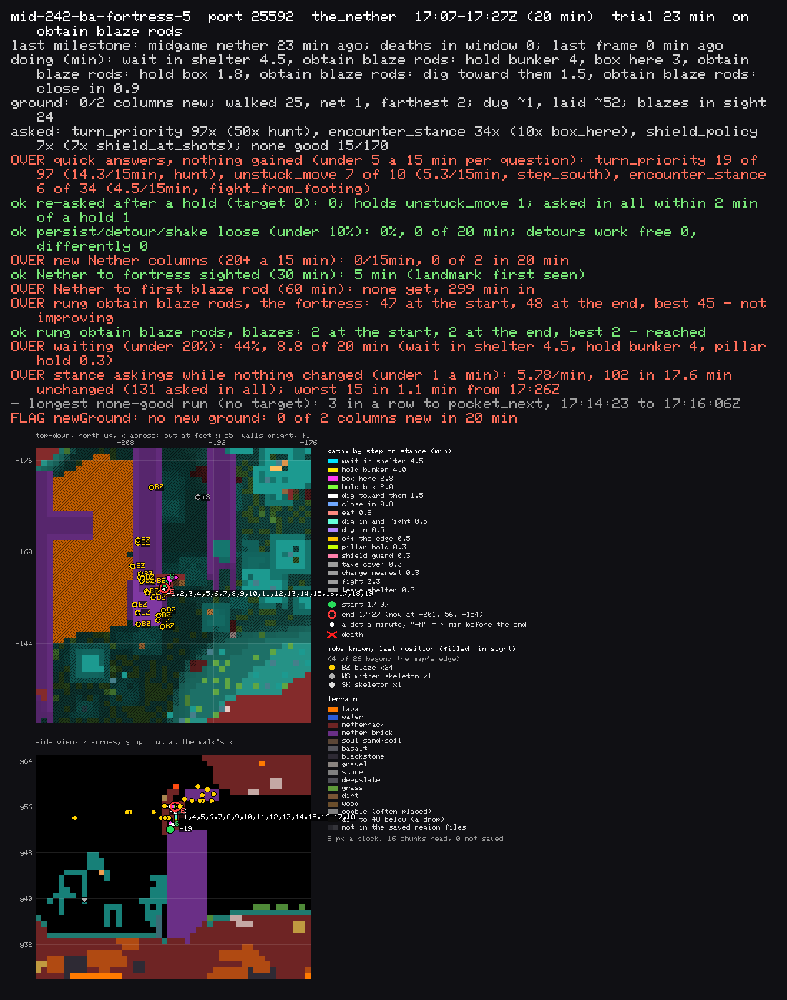

# jevcraft

jevcraft is a Minecraft Survival bot built on [mineflayer](https://github.com/PrismarineJS/mineflayer). Code handles the mechanics: pathfinding, digging, crafting, combat moves. The judgment calls go to [TypeSafe's Jev](https://typesafe.ai/), a [System One](https://docs.typesafe.ai/concepts/system-one) model that picks one option from a typed list in about 0.2 seconds.

The goal is to beat the game from a fresh world with an empty inventory ([GOAL.md](GOAL.md)). This README explains how the bot puts decisions to Jev, what we tried, and what we learned. The bot also works as a chat companion you can play alongside.

| | |
|---|---|
|  |  |
| Killing a wither skeleton. Jev chose `shield_guard` (p=0.98). | Killing a blaze for a rod. Jev chose `close_in` (p=0.42) over digging in (0.21) and leaving them (0.14). |
|  |  |
| Entering the Nether 7 minutes into a fresh world. | Knocked into lava by a ghast fireball while fighting (`fight`, p=0.22). This death led to note 612, which added stepping back from the edge as an option. |

The clips are rendered with ReplayMod from recordings of the trials.

## Status (2026-09-28)

- The first three in-game days (iron tools and armor, a shield, a bed, a home, no deaths) pass reliably.
- Fresh worlds reach the Nether in 7 to 30 minutes, and usually find a fortress.
- Blaze rods are the current wall. A handful of trials have taken one or two; none has taken the six needed. Most deaths are blazes at a spawner, fireballs pushing the bot into lava, and running out of health in the Nether with little food.
- The dragon has only been fought from staged worlds.

Every trial and every fix is a numbered entry in [docs/trial-notes.md](docs/trial-notes.md). This README cites them as "note N".

## Run it yourself

You need Node.js 22 or newer, a [TypeSafe](https://typesafe.ai/) API key, and macOS or Linux. The trial scripts download Java and the Minecraft server for you.

```sh
git clone https://github.com/mrubens/jevcraft.git
cd jevcraft
npm ci
cp .env.example .env    # then set TYPESAFE_API_KEY in .env
```

### Play alongside Jev

Point the bot at a Minecraft Java 26.1 server you run. In `.env`, set `MC_HOST` and `MC_PORT` (defaults: localhost, 25565). Leave `MC_AUTH=offline` for an offline-mode server, or use `MC_AUTH=microsoft` with a separate account for the bot. Then:

```sh
npm start
```

Join the same server and talk to it in chat, for example `Jev come here` or `Jev your dream is to beat the game`. See [Using Jev as a chat companion](#using-jev-as-a-chat-companion).

### Run a trial

A trial gives Jev a fresh world on its own server and judges the result, the way we test it.

```sh
sh scripts/trials/setup.sh 1                          # Java 25, the 26.1.2 server, Fabric and ServerReplay; one server folder on port 25581
node scripts/first-days.js start first-days-1         # a fresh Normal world and a fresh bot
node scripts/first-days.js verdict                    # how it is going, or how it ended
node scripts/trials/trail-map.js 25581 --minutes 15   # a map of where it has been, in artifacts/trails/
```

The first-days trial lasts an hour of real time, three in-game days. To watch, run `sh scripts/trials/spectate.sh <your Minecraft name> &` and join `localhost:25581`; it puts you in Spectator mode on Jev. To run several at once, pass a larger number to `setup.sh` and choose a server with `FIRST_DAYS_PORT=25582`. Later stages (the Nether, fortresses) start from a world a first-days trial finished: see `scripts/midgame.js` and [scripts/README.md](scripts/README.md). Each trial server uses up to 2 GB of memory and about one CPU core.

## How it works

Code decides what is possible. Jev decides what to do.

- Code builds the options from the game state. Jev never names a coordinate, item or command, and its pick is checked against what was offered.
- Each option's description says what it does, what it costs (damage and seconds, against the bot's actual health) and what it gains toward the goal. Mob behavior and numbers such as fireball knockback are taken from the game's own code and checked on a test server.
- Every play question also offers `none_good`: "the move a player would make is not listed". If Jev picks it, code logs a missing option and takes the highest-probability listed one. Those logs became a worklist for new options.
- If only one option is possible, Jev is not asked.
- Each question has a code fallback, used only if the service is down or too slow.

### One decision, end to end

Take a fight. A *stance* is the answer to the fight question `encounter_stance`: what to do about the mobs here for the next few seconds.

1. A blaze comes into view. The survival layer claims the turn.
2. Code builds the `encounter_stance` options that are possible from where the bot stands: charge the nearest blaze, walk in and fight all of them, take cover, wall itself in, leave to heal, and so on. Each is priced from the fight at hand ([src/blaze-stand.js](src/blaze-stand.js), [src/combat-estimate.js](src/combat-estimate.js)).
3. Code reads what was already tried from here. An option that came to nothing twice is left out for five minutes and listed as resting.
4. The state and the options go to Jev in one HTTPS call ([src/typesafe.js](src/typesafe.js)). Jev returns a probability for every option, in about 0.18 seconds. A stance question is 1,500 to 8,000 tokens.
5. Code checks the pick is one it offered and runs it: walks, raises the shield, swings.
6. The answer is *held* until a fact it was chosen on changes (the blaze moves or dies, health drops, a new mob arrives), and then the question is asked again with the new facts.
7. How it went is recorded: progress, or nothing gained and why. That record decides what is offered next time.

Trials make about 500 of these decisions per bot per hour.

### What Jev sees

The `state` is not a dump of the game. It holds what a player would weigh for this decision, worked out by code: health, armor and weapon, the threats with their distance and whether they can be reached, and a fight estimate. A few context fields appear on every play question:

- `riskNow`: how bad things are right now (hostiles in range, shots incoming, what fighting all of them would cost).
- `healing`: whether health comes back here, what food is carried, where the nearest food is.
- `deathWouldCost`: what would drop, the walk back from respawn, and the real minutes to make it all again.
- `runClock`: minutes played, what the bot is working on, and where the time has gone. This lets Jev see it has spent too long on something.
- `recentPositions`: where the bot has been, every 15 seconds, so it can see it is going in circles.
- `previousStance`: the last answer to this question, how long ago, and why it is being asked again.

Some fields are sentences rather than numbers. Code never reads them; they are there for Jev, and the instructions that explain each field are only sent when the field is present. Field names keep the codebase's British spelling (`armour`).

Here is a real `encounter_stance` question from a trial (mid-242-af-nether-3-fortress-5, 17:10:53Z), shortened. The bot is at a fortress, burning, with one blaze in sight 8 blocks off and more nearby. `estimate.fightHere` is the price of fighting everything in reach where it stands; each option prices its own plan.

```json
{
  "health": 17.5, "food": 20, "dimension": "the_nether",
  "armour": ["iron_helmet", "iron_chestplate", "iron_leggings", "iron_boots"],
  "weapon": "iron_sword", "shield": true, "buildingBlocks": 464,
  "threats": [{ "name": "blaze", "distance": 8.3, "shoots": true, "visible": true }],
  "estimate": { "fightHere": { "seconds": 6.3, "damageTaken": 3.2, "healthAfter": 14.3 } },
  "alight": "The bot is alight at 17.5 health: about 4.7 seconds of fire left, a health a second that armour does not stop. Water puts it out at once; the Nether has none.",
  "riskNow": { "level": "high: the mobs about could kill the bot if they all came",
               "hostilesWithin": { "blocks": 24, "count": 6, "inSight": 1, "shooters": 6 },
               "shotsComingAtTheBot": 2 },
  "healing": { "healthComesBack": "yes: at full hunger ...", "foodCarried": "nothing to eat",
               "nearestFood": ["1 hoglin seen just now, 35 blocks north-west"] },
  "deathWouldCost": { "dropsWorn": ["iron helmet", "iron chestplate", "iron leggings", "iron boots", "shield"],
                      "levelsLost": 7, "realMinutesToMakeAgain": { "iron pickaxe": 5, "iron armour": 9 } },
  "runClock": { "minutesPlayed": 163, "nowOn": "obtain blaze rods" }
}
```

Fifteen options were offered. Three of them, cut short, with the probability Jev gave each:

> `charge_nearest` (0.26): Charge the nearest blaze alone: 8.3 blocks off, over ground the bot can stand on within a sword's reach of it; walk in on it while the volleys rest, behind the shield for each as it comes, strike it until it dies, pick up its rod if it drops one, and be asked again then with what is left ...
>
> `leave_and_heal` (0.20): Walk 9 blocks (about 2.8 seconds in their fire, about 2.9 damage) to (-170, 58, 128), where none of the 4 blazes about has a line to the bot, stay until the health is full ... The blazes stay where they are; the fight after is asked again with the health back ...
>
> `keep_working` (0.00): Carry on with the work and leave these mobs be for fifteen seconds ... The blaze in sight keeps shooting while the bot works: about 19 damage in the fifteen seconds, from 18 health, more than the bot has.

The others included `close_in` (0.23) and `take_cover` (0.12). Jev picked `charge_nearest`. Every option says what it gains toward the goal; `take_cover` ends "Toward the rods: none, no blaze killed; the blazes stay, and waiting does not send them away; 7 rods still needed." Before that line was added (note 614), cover and retreat were priced only in damage and looked cheap next to fighting.

A smaller example from the replay suite (`poisoned-by-witch-apple-offered`): the bot is at 1 health, poisoned, in full iron, with a witch 19 blocks off.

> `fight`: ... about 10.2 seconds and 14.4 damage to kill them all, from 1 health (more than the bot has) ...
>
> `eat_golden_apple`: Eat the golden apple now (2 carried): about 1.6 seconds eating while the mobs hit, then four extra health as absorption and regeneration of about eight health over five seconds.
>
> `retreat`: ... A witch walks after a player it has seen and throws within about ten blocks; a run that stays in its sight stays in its reach.

In the replay suite Jev picks the apple or the retreat; either is accepted, since neither is clearly right at 1 health.

### Defining a question

Questions are declared in [src/decisions/](src/decisions/index.js). This is the shield question in full:

```js
define({
  id: 'shield_policy', area: 'combat', parent: 'encounter_stance', kind: 'combat', primitive: 'choice', stakes: 'medium', tree: true,
  question: 'Shooters can hit the bot and a shield is carried: raise the shield at each shot on its way, or leave it down and keep on?',
  trigger: 'In an encounter, a shield in the off hand and a shooter in sight or a shot on its way ...; held until a shooter not counted comes, health falls four, or a minute.',
  source: 'src/survival.js (shieldPolicy), src/projectile-guard.js (deflect)',
  options: [
    { key: 'shield_at_shots', label: 'raise the shield at each shot on its way', when: 'always; said with each shooter\'s shot flight time ...', level: 'root' },
    { key: 'take_shots', label: 'leave the shield down and keep on with the stance or the step', when: 'always; said with what each shooter\'s shot does to the bot ...', level: 'root' },
  ],
  instructions: { task: 'Shooters can hit the bot and it carries a shield. Choose what the bot does about their shots for the next while.', guidance: 'A shot cannot be answered one by one: it lands in well under a second, and the shield takes a quarter second to rise. ...' },
  fallback: () => 'shield_at_shots',
});
```

`parent` is the question asked instead when every option here has come to nothing. `when` documents when each option is offered and what its description must say; the code that builds the description lives in the file named in `source`. [docs/decisions.md](docs/decisions.md) is generated from these definitions (`node scripts/decisions-doc.js`). There are 91 questions: 43 decision trees, most of them in play, and 48 smaller questions sent together to read chat requests.

### What stays in code

Jev only chooses among options, so some things are not questions:

- Physical safety. The pathfinder refuses moves onto gravel over lava, and a guard on every dig refuses one that would let lava in or drop the bot into it.
- Anything faster than an answer. A shot lands in less time than a question takes, so Jev sets a standing policy (`shield_policy`) and code raises the shield at each shot.
- Checking the answer. A pick that was not offered is rejected.
- The fallback when the service is down.

[docs/rule-audit.md](docs/rule-audit.md) lists what code still decides and why.

Jev is only as good as the options and prices it is given. It cannot invent an option, and it does not redo arithmetic that the description got wrong. When it chooses badly, the cause has almost always been a missing option or a false fact.

## What we tried and learned

### Confidence gates

At first, a low-confidence pick was handed to hand-written rules. In practice the rules then played most of the hard moments. We now take Jev's pick at any confidence on play questions. Confidence bars remain only for requests from a person (chat, server commands, builds that replace something).

### Reflexes

Lava escapes, fire escapes, creeper dodges and shield use used to run before Jev was asked. Several deaths started with a reflex (note 548). They are now questions, such as `body_way` for lava, fire and suffocation, with code only as the fallback (note 549).

### Who gets the turn

Survival, eating and work each used to take control by their own rules. Now each states a claim and Jev picks one (`turn_priority`, [src/arbiter.js](src/arbiter.js)). The question can hang, so the arbiter falls back if the bot is hurt while waiting or five seconds pass.

### Fix facts, not rules

When Jev chooses badly, the fix is almost always a wrong price, a false fact or a missing option, not a new threshold. In note 614, Jev kept choosing cover with a blaze four blocks away. The charge was offered only when the bot had a shield, which it didn't; other options' text assumed the shield it didn't have; and no option said what it gained toward the rods. Fixing those changed the answers.

### Loops

Deaths are easy to spot. Trials that stay busy without progressing are not: pacing a bridge for 70 minutes, or sitting in a sealed pocket for half an hour. Each feature used to keep its own list of what had failed, and none saw the others; one question was answered the same way 4,423 times. We replaced them with one shared record of what has been tried and what came of it, the *ledger* ([src/tried.js](src/tried.js), note 571). An option that came to nothing twice rests for five minutes. When every option rests, the parent question is asked instead and told what failed. Waiting and holding a stance are recorded the same way, so a wait that changed nothing counts as a failure (notes 599, 611).

### Time budgets

Each step of the game, such as "obtain blaze rods", gets ten minutes without progress. Then Jev is asked whether to keep going, change plan, or set it aside for a while.

### Price the fight in front of the bot

Quoting an arena average against three distant blazes to a bot facing four at a spawner made charging in look cheap (note 602). Prices now come from the fight at hand.

### Blaze tactics

We built boxing in, lighting the spawner, a corner ambush and retreating to heal, and measured them in an arena (below). At a live spawner none beat walking in and fighting. The safe ones produce no rods. They are still offered, with their measured numbers (note 606).

### A second model

A generative LLM reviewing recovery decisions agreed with Jev, took 14 seconds per decision, and cost about a hundred times more. We removed it.

### Judging trials

Judging by deaths alone missed some of the worst trials, which never died. The progress audit and trail maps now flag trials that aren't getting anywhere.

## How we iterated

1. Run 7 to 20 trials in parallel, one Minecraft server each. Most start from saved stages (entering the Nether, reaching a fortress) so the hard parts get many attempts per hour. Stage saves come from [checkpoint.sh](scripts/trials/checkpoint.sh), which snapshots every trial every 30 seconds.
2. A watcher reports each death or loop. The [progress audit](scripts/trials/progress-audit.js) and trail maps catch trials that are stuck without failing.
3. A Claude subagent triages each failure in its own git worktree. It starts from the [death timeline](scripts/death-timeline.js), which shows the last seconds frame by frame with every decision, and the [flight record](src/recorder/index.js), one frame per second plus one per decision. It fixes the cause in general, adds tests that fail without the fix, checks the recorded question against live Jev before and after, and writes a trial note. Most of notes 500 to 618 were written this way.
4. Fixes are merged in a separate worktree after `npm test`, a `JEV_ARBITER=shadow` check and the [replay suite](scripts/replay-suite.js): recorded questions from past failures, each with acceptable and forbidden answers, asked live five times. The suite runs in seconds with no Minecraft server.
5. Bots pick up new code with a quiet restart: each quits once no mob is within 16 blocks, or after five minutes, and its supervisor restarts it.
6. Every three hours, a Fable subagent reads the trial notes, the logs and the open problems and gives design advice, without changing code. We act on the advice that holds up. Two of its reviews changed the design: one recommended the single ledger in place of the separate lists (note 571), and one found that held stances were not recorded in the ledger, which explained a whole class of loops (note 599).

### The arena

[scripts/arena.js](scripts/arena.js) stages fights on a separate server (a blaze spawner, wither skeletons, hoglins) and runs the real survival code against them. The results are quoted to Jev in the option descriptions. Four blazes at a live spawner, with iron armor, a sword and a shield (note 606):

| Tactic | Runs | Kills | Rods | Median damage per run (20 = full health) | Deaths |
| --- | --- | --- | --- | --- | --- |
| Walk in and fight (`close_in`) | 10 | 17 | 7 | 32.2 | 3 |
| Walk in, leave to heal when hurt (`leave_and_heal`) | 5 | 4 | 3 | 23.6 | 1 |
| Wall in where it stands, one window (`box_here`) | 5 | 0 | 0 | 31.5 | 1 |
| Walk to the spawner and wall in there (`box_at_spawner`) | 5 | 0 | 0 | 33.8 | 3 |
| Light up the spawner (`light_spawner`) | 5 | 0 | 0 | 32.8 | 4 |
| Wait round a corner (`corner_ambush`) | 5 | 1 | 0 | 32.2 | 3 |

Damage above 20 means the bot healed during the run. A blaze drops a rod about half the time. Walking in was the only tactic that got rods; the box was safe once built, but blazes don't come to a window.

### Trail maps

[trail-map.js](scripts/trials/trail-map.js) draws one PNG per trial from the server's saved region files: a top-down map and a side view, the path colored by what the bot was doing, and the audit's flags in the header (red is over the limit). This trial spent 20 minutes in a bunker beside a blaze spawner: 25 blocks walked, one block of net movement, no new ground.



### Running many trials on one machine

- CPU runs out first. Twenty trials saturated 16 cores and bots stalled 2 to 4 seconds at a time, which kills them in fights. About 14 is the practical limit.
- The decision service has outages. The bot uses its fallbacks and says so in chat; deaths during an outage aren't triaged.
- Anything that watches trials needs a timeout. A hung check once kept the watcher silent for five hours while trials failed.

More operational notes are in [scripts/README.md](scripts/README.md).

## Code map

| Area | Where |
| --- | --- |
| Questions, `none_good`, escalation | [src/decisions/](src/decisions/index.js) |
| TypeSafe client | [src/typesafe.js](src/typesafe.js) |
| Turn arbiter | [src/arbiter.js](src/arbiter.js) |
| Ledger and holds | [src/tried.js](src/tried.js), [src/holds.js](src/holds.js) |
| Survival and body dangers | [src/survival.js](src/survival.js), [src/body.js](src/body.js) |
| Fight prices | [src/combat-estimate.js](src/combat-estimate.js), [src/blaze-stand.js](src/blaze-stand.js) |
| Game ladder | [src/game-progress.js](src/game-progress.js), [src/work.js](src/work.js) |
| Dreams | [src/dream.js](src/dream.js) |
| Nether travel | [src/nether-travel.js](src/nether-travel.js), [src/fortress-map.js](src/fortress-map.js) |
| Movement | [src/movement.js](src/movement.js), [src/motion.js](src/motion.js) |
| Trials | [scripts/trials/](scripts/trials/), [scripts/midgame.js](scripts/midgame.js) |
| Rendered replays | [scripts/trials/highlights.js](scripts/trials/highlights.js), [death-camera.js](scripts/trials/death-camera.js) |

More in [docs/](docs/README.md). [How Jev thinks](docs/how-jev-thinks.md) walks through a chat request end to end.

---

## Using Jev as a chat companion

The same bot takes requests in game chat. Setup is under [Play alongside Jev](#play-alongside-jev). Start messages with "Jev":

| Request | What it does |
| --- | --- |
| `Jev follow me` | Follow until stopped. |
| `Jev get me a pumpkin` | Find, collect and deliver one. |
| `Jev give me full diamond armor and a bed` | Plan all items together, sharing materials. |
| `Jev find a cherry biome` | Explore. |
| `Jev build a small cherry mansion` | Design and build. |
| `Jev remember this as home` / `Jev go home` | Named places. |
| `Jev status` / `stop` / `resume` | Control the current task. |

A new request replaces the current one, and tasks survive restarts (state is in `.bot-state/`). When a request is ambiguous, Jev asks, for example "Did you mean short grass or grass block?" Server commands work only for players listed in `MC_COMMAND_USERS`, and are never used on the bot's own initiative. Settings are in [.env.example](.env.example).

### Dreams

A dream is a standing goal that Jev works toward whenever nobody has asked it for anything. There are two:

- `Jev your dream is to beat the game`: Jev climbs the game ladder, from wood and stone tools through iron, a shield, a bucket, a home with a bed, iron armor, then the Nether, blaze rods, ender pearls, the stronghold and the dragon. This is the same ladder the trials run: every trial starts with this dream set, and "obtain blaze rods" in the example above is one of its steps.
- `Jev your dream is to build a village`: Jev looks at what already stands and picks the next building from the designs it has, until it judges the village complete.

A chat request always comes first; the dream picks up again when the request is done. `Jev set your dream aside` pauses it, `Jev chase your dream` resumes it, and `Jev what is your dream` reports progress. Progress is read from the world (what is carried, worn and built), never from a counter, so a dream survives restarts.

### Building, and Creative mode

In Survival, Jev builds from templates (cottage, mansion, tower) that it configures, or picks from about 30 ready-made designs, and gathers the materials first.

In Creative mode the bot has every block, so building is limited only by the design. Here you can connect a generative LLM as the designer: set `OPENROUTER_API_KEY` and `BUILD_DESIGNER=openrouter` (or `auto`), and choose the model with `OPENROUTER_BUILD_MODEL` (default `anthropic/claude-opus-5.5`). The LLM draws a schematic from the request and a survey of the terrain. Code checks that it is valid (up to 25 × 16 × 25 blocks, at most 16 materials), and Jev judges whether it matches the request before any block is placed. Jev never builds over a structure it did not place. Without a key, or with `BUILD_DESIGNER=jev`, it uses the templates.

## Development

```sh
npm test                        # about 2,000 tests, no server or key
node scripts/replay-suite.js    # recorded decisions, asked live
```

Gameplay tests, trials and the arena need a separate, disposable server. See [CONTRIBUTING.md](CONTRIBUTING.md). Flight records and logs can contain chat, player names and coordinates, so review them before sharing. The [roadmap](ROADMAP.md) has what's next. MIT License ([LICENSE](LICENSE)).

## Restrictions

Jev never hurts a chicken or a pig (they are the favorite animals of the author's daughters).
